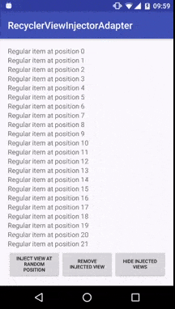

# RecyclerViewInjectorAdapter

``RecyclerViewInjectorAdapter`` wraps your regular ``RecyclerView.Adapter`` and adds possibility to inject custom views on desired position without hassle.

Overview
-----------
* Tested in production - over 1000 000 installs in the [Holidaycheck app](https://play.google.com/store/apps/details?id=com.holidaycheck)
* Works with stable ids & no stable ids adapters
* In most cases requires no changes to your adapter (see the caution)
* Supports multiple view injections
* Supports all items animations
* Supports Android 15+

## Demo

[](https://www.youtube.com/watch?v=R9rFW_23710)

Add it to your project
----------------------

Include the library in your ``build.gradle``

```groovy
dependencies{
    compile 'com.holidaycheck:recyclerviewinjectoradapter:1.0.3'
}
```

or to your ``pom.xml`` if you are using Maven

```xml
<dependency>
    <groupId>com.holidaycheck</groupId>
    <artifactId>recyclerviewinjectoradapter</artifactId>
    <version>1.0.3</version>
    <type>aar</type>
</dependency>

```

Configuration
-----
To enable injecting views you need to wrap your regular adapter with ``RecyclerViewInjectorAdapter`` and set it to ``RecyclerView``.

Assuming that your code looks similar to this one

```java
MyAdapter adapter = new MyAdapter();

RecyclerView recyclerView = findViewById(R.id.recycler_view);
recyclerView.setAdapter(adapter)
```
You should change it to

```java
MyAdapter adapter = new MyAdapter();
RecyclerViewInjectorAdapter injectorAdapter = new RecyclerViewInjectorAdapter(adapter)

RecyclerView recyclerView = findViewById(R.id.recycler_view);
recyclerView.setAdapter(injectorAdapter)
```

Usage
-----

After the configuration you can inject views
```java
injectorAdapter.inject(new InjectedViewCreator() {
    @Override
    public View createView() {
        Button button = new Button(getApplicationContext());
        button.setText("This is injected Button on position 5");
        return button;
    }
}, 5);

```

Remove injected view by passing position
```java
injectorAdapter.removeInjectedView(5);
```

There are some methods to control the visibility of injected views

Method | Description
--- | ---
``setShowInjectedViews(boolean showInjectedViews)`` | Allows to hide or show all injected views
``setDisplayInjectedViewsOnEmptyChildAdapter(boolean display)`` | Decides if injected views should be displayed on empty child adapter
``setDisplayInjectedViewsOnLowerPosition(boolean display)`` | Decides if injected views should can be displayed on lower position than desired. For example view is injected on position 10, but child adapter has only 5 items.

For more details take a look at the javadoc.

Caution
-----
* Every update that refers to the regular item should be dispatched to your child adapter.
* ``getAdapterPosition()`` method of your `RecyclerView.ViewHolder` now returns position that include also injected views below that position. To get the position without injected views included please use ``int realChildAdapterPosition = injectorAdapter.toChildAdapterPosition(getAdapterPosition())`` or get rid of ``getAdapterPosition()`` by passing reference to your data to ViewHolder and then getting position from your underlying data structure.

Do you want to contribute?
-----
Feel free to add any cool and useful feature to the library.

License
-------
    The MIT License (MIT)

    Copyright (c) 2016 HolidayCheck

    Permission is hereby granted, free of charge, to any person obtaining a copy of
    this software and associated documentation files (the "Software"), to deal in
    the Software without restriction, including without limitation the rights to
    use, copy, modify, merge, publish, distribute, sublicense, and/or sell copies of
    the Software, and to permit persons to whom the Software is furnished to do so,
    subject to the following conditions:

    The above copyright notice and this permission notice shall be included in all
    copies or substantial portions of the Software.

    THE SOFTWARE IS PROVIDED "AS IS", WITHOUT WARRANTY OF ANY KIND, EXPRESS OR
    IMPLIED, INCLUDING BUT NOT LIMITED TO THE WARRANTIES OF MERCHANTABILITY, FITNESS
    FOR A PARTICULAR PURPOSE AND NONINFRINGEMENT. IN NO EVENT SHALL THE AUTHORS OR
    COPYRIGHT HOLDERS BE LIABLE FOR ANY CLAIM, DAMAGES OR OTHER LIABILITY, WHETHER
    IN AN ACTION OF CONTRACT, TORT OR OTHERWISE, ARISING FROM, OUT OF OR IN
    CONNECTION WITH THE SOFTWARE OR THE USE OR OTHER DEALINGS IN THE SOFTWARE.
